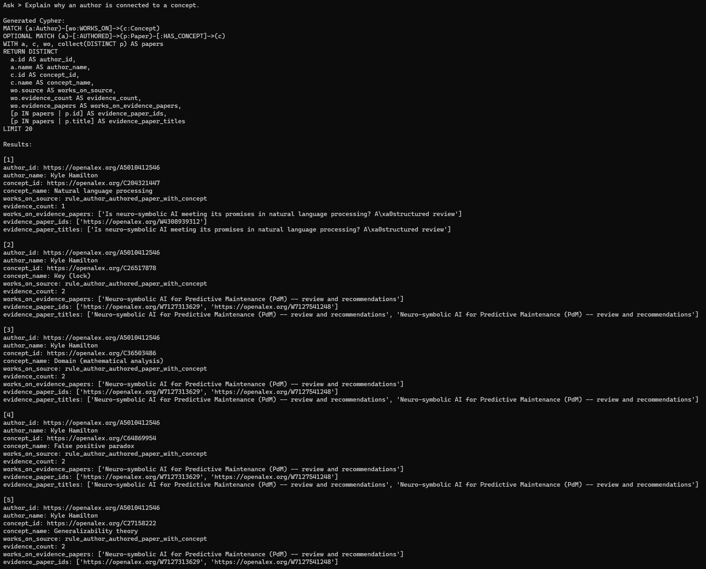
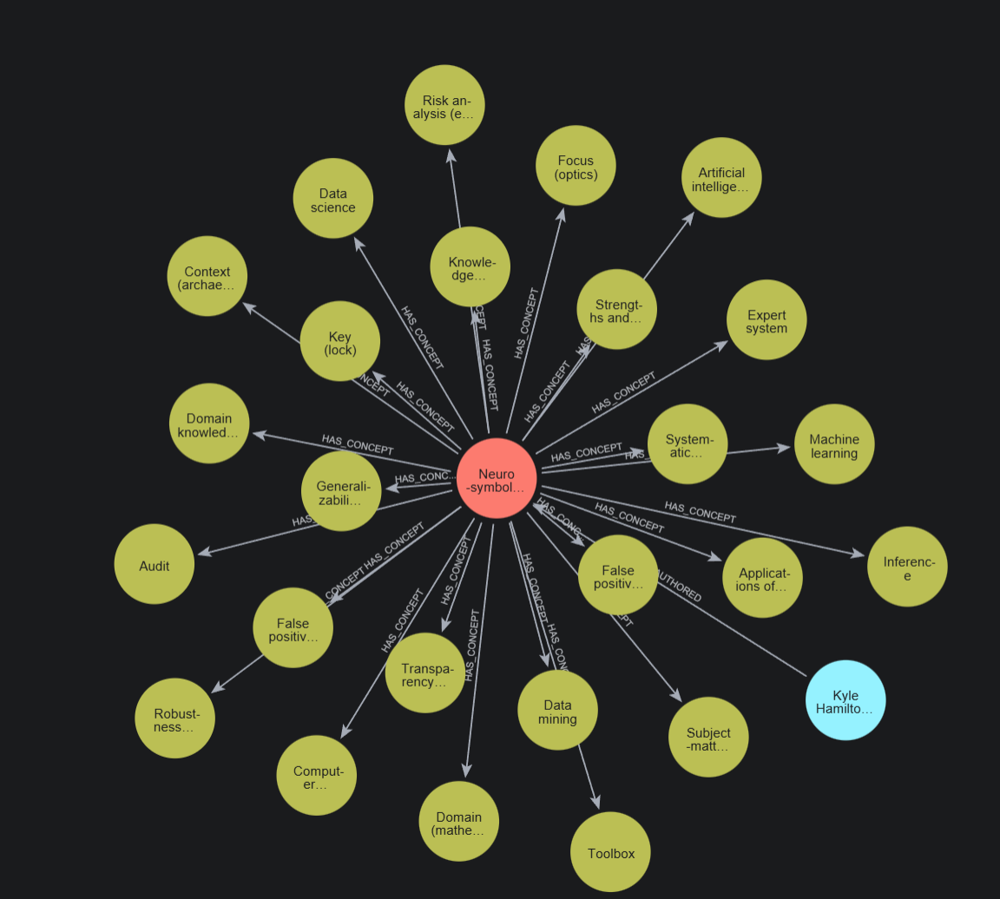
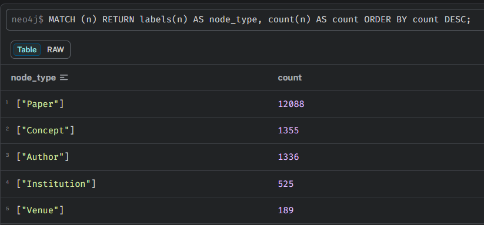
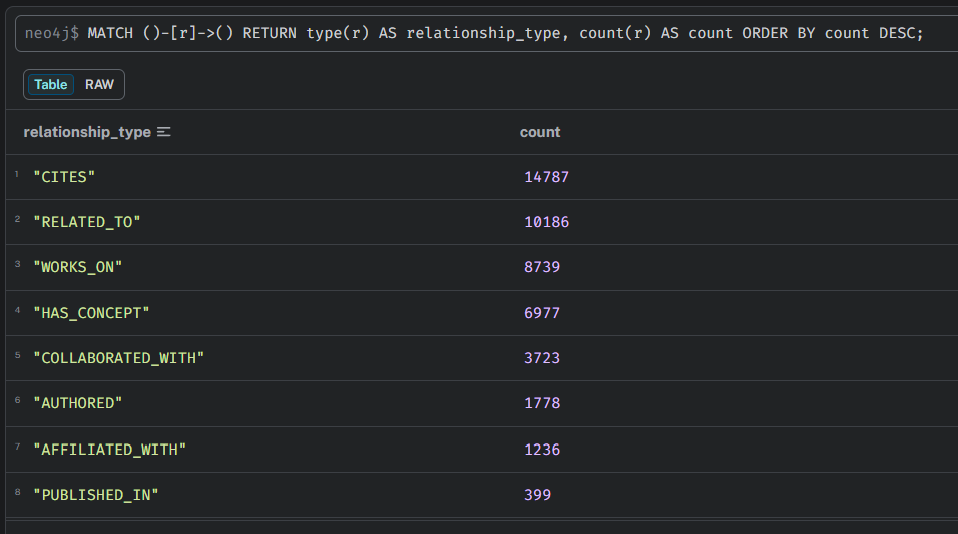
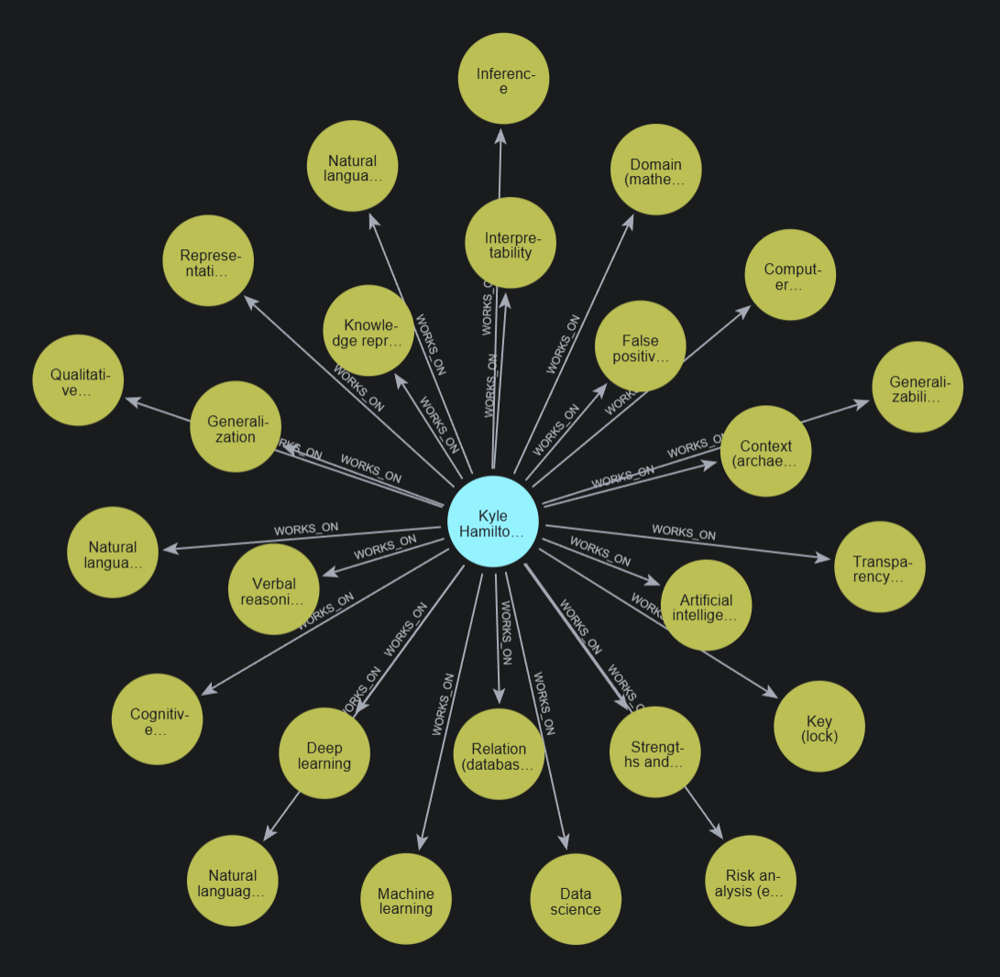

# OpenAlex Neo4j NL-to-Cypher QA

A prototype natural language question-answering system built on a Neo4j knowledge graph using OpenAlex academic data and Azure OpenAI.

This project translates natural language questions into read-only Cypher queries, executes them against a local Neo4j database, and returns the results. It includes symbolic rule derivation to create secondary relationships (such as `WORKS_ON` or `COLLABORATED_WITH`) for improved reasoning and explainability.

## Key Features

- **Natural Language to Cypher:** Translates natural language queries into valid Neo4j Cypher queries using Azure OpenAI.
- **Explainable AI:** Explains relationships between entities by returning the specific underlying works as evidence.
- **Symbolic Rule Derivation:** Utilizes Cypher to infer and construct new relationships based on existing graph patterns, integrating explicit evidence into the graph.
- **Security Validations:** Enforces read-only query execution (`MATCH`, `RETURN`) by actively blocking unsafe operations (`CREATE`, `DELETE`, `APOC`, etc.).

---

## Prerequisites

- **Python 3.8+**
- Local or remote **Neo4j** database with OpenAlex data loaded.
- **Azure OpenAI** API credentials.

---

## Setup Instructions

### 1. Fetch OpenAlex Data
To populate the Neo4j database, academic data from the OpenAlex API is required. This prototype utilizes a dataset of approximately 500 papers related to "neuro-symbolic AI".

Fetch the data and save it to `openalex.json` (this file is git-ignored):

```bash
curl "https://api.openalex.org/works?search=neuro-symbolic%20AI&per-page=200" > openalex.json
```
*(Note: A production environment would require a script to manage pagination and ingest this JSON directly into Neo4j via the Python driver).*

### 2. Environment Configuration
Create a virtual environment, activate it, and install the required dependencies:
```bash
pip install neo4j openai python-dotenv
```

Create a `.env` file in the root directory and configure the database and API credentials:
```env
NEO4J_URI=bolt://localhost:7687
NEO4J_USER=neo4j
NEO4J_PASSWORD=your_neo4j_password

AZURE_OPENAI_API_KEY=your_azure_openai_api_key
AZURE_OPENAI_ENDPOINT=https://your-endpoint.cognitiveservices.azure.com/
AZURE_OPENAI_DEPLOYMENT=your_deployment_name
AZURE_OPENAI_API_VERSION=2025-04-01-preview
```

### 3. Rule Derivations (Optional)
To enhance graph reasoning capabilities, execute the symbolic rules defined in `rules.cypher` via the Neo4j Browser. This generates derived relationships, such as `WORKS_ON` and `COLLABORATED_WITH`.

---

## Usage

Execute the interactive QA script:

```bash
python nl_to_cypher.py
```

**Example Interaction:**
```text
OpenAlex Neo4j Natural Language QA using Azure OpenAI
Type 'exit' to quit.

Ask > Explain why an author is connected to a concept.

Generated Cypher:
MATCH (a:Author)-[w:WORKS_ON]->(c:Concept)
...
```

---

## Screenshots

**1. Natural Language to Cypher Interactive CLI**  
Demonstrates the CLI translating a natural language query into a Cypher query, executing it against the graph, and summarizing the result.



**2. OpenAlex Knowledge Graph Visualization**  
A visual representation of the academic data structure in Neo4j Browser, illustrating the connections between Authors, Works, and Concepts.



**3. Dataset Node Summary**  
Summary table displaying the distribution and counts of entities (Works, Authors, Concepts, Institutions) present in the database.



**4. Graph Relationship Statistics**  
Overview of the connections between distinct nodes and their total frequencies within the knowledge graph.



**5. Symbolic Rule Derivation (`WORKS_ON`)**  
Displays the execution and result of applying a Cypher rule to derive explicit `WORKS_ON` relationships, enriching the graph for advanced reasoning.



---

## Project Structure

- **`nl_to_cypher.py`**: The primary interactive Python script managing Azure OpenAI API requests, Cypher generation, security validation, and Neo4j database querying.
- **`rules.cypher`**: Cypher script containing rules to derive explainable relationships within the graph.
- **`queries.cypher`**: A collection of manual, analytical Cypher queries for dataset exploration and Neo4j Browser visualization.
- **`screenshots/`**: Visual documentation of the graph structures and system outputs.
